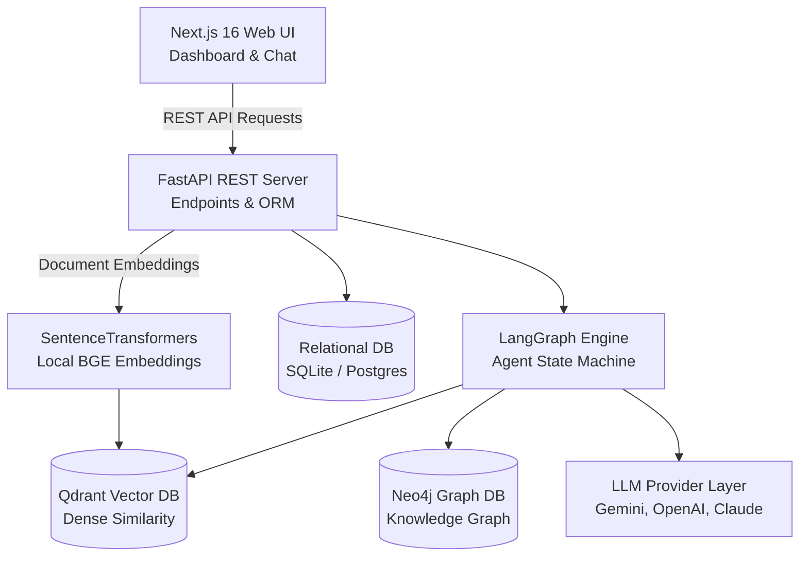
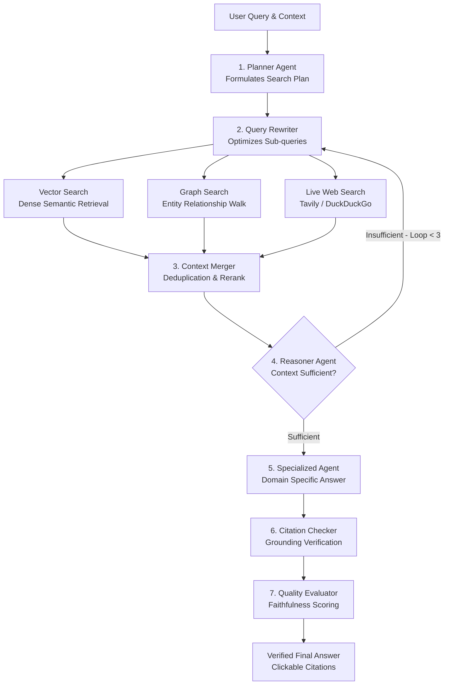
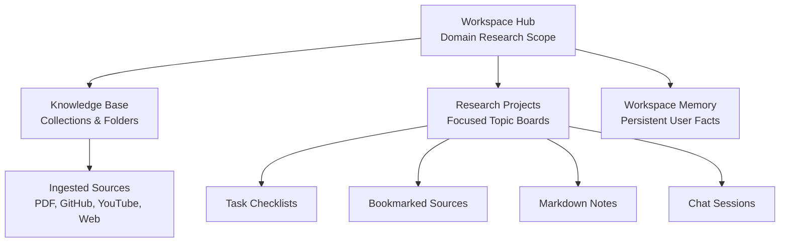

# AI Research Workspace (Agentic Knowledge Platform)

[](https://fastapi.tiangolo.com/)
[](https://nextjs.org/)
[](https://langchain-ai.github.io/langgraph/)
[](https://qdrant.tech/)
[](https://neo4j.com/)
[](LICENSE)

> **A production-grade AI Research Workspace and Knowledge Platform** that unifies document ingestion, hybrid vector/graph retrieval, multi-agent orchestration via LangGraph, dual-tier memory, and project management into a cohesive research environment.

---

## 📑 Table of Contents

1. [Platform Overview & Vision](#-platform-overview--vision)
2. [System Architecture](#-system-architecture)
3. [LangGraph Multi-Agent Workflow](#-langgraph-multi-agent-workflow)
4. [Data Hierarchy & Project Management](#-data-hierarchy--project-management)
5. [Core Engineering Highlights](#-core-engineering-highlights)
6. [Repository Layout](#-repository-layout)
7. [API Reference](#-api-reference)
8. [Getting Started](#-getting-started)
   - [Prerequisites](#prerequisites)
   - [Local Development (Zero-Docker Mode)](#1-local-development-zero-docker-mode)
   - [Production Deployment (Docker Compose)](#2-production-deployment-docker-compose)
9. [Verification & Testing](#-verification--testing)

---

## 🎯 Platform Overview & Vision

Most standard RAG implementations follow a primitive loop: *PDF ➔ Chunks ➔ Embeddings ➔ Vector Search ➔ Chat Output*. 

**AI Research Workspace** is positioned not as a simple chatbot, but as an **Agentic Research & Knowledge Management Environment** designed for rigorous technical workflows:

- **Token-Conserving Ingestion**: Ingests multi-modal sources (arXiv PDFs, GitHub repos, YouTube timestamped lectures, technical blogs) with syntax-aware and AST-aware chunking without burning LLM tokens during preprocessing.
- **Local-First Dense Embeddings**: Embeds documents using pre-trained HuggingFace `SentenceTransformers` (`BAAI/bge-small-en-v1.5`) running completely locally on your hardware with zero API costs, zero rate limits, and deterministic output.
- **Hybrid Retrieval & GraphRAG**: Combines local dense vector search (Qdrant), entity-relationship knowledge graph traversal (Neo4j), and live web scraping (Tavily / DuckDuckGo).
- **LangGraph Multi-Agent Orchestration**: A cyclic, state-driven multi-agent graph with dynamic query rewriting, sufficiency reasoning loops, specialized domain agents, automated citation verification, and RAG quality evaluation.
- **Dual-Tier Memory**: Distinguishes between ephemeral **Conversation Memory** (session chat context) and persistent **Workspace Memory** (user facts, research goals, tool preferences).
- **Integrated Project Management**: Connects documents to projects featuring interactive task checklists, document bookmarks, personal markdown notes, and verified source citations.

---

## 🏛 System Architecture

The following diagram illustrates the high-level system architecture across client, API services, hybrid storage, and foundation models:



### 🔍 Architecture & Implementation Details

| Layer / Component | File Reference | Technical Implementation & Responsibility |
|---|---|---|
| **Client Layer (Next.js 16)** | [`frontend/src/app/page.tsx`](file:///d:/AI%20_Research_%20Workspace/frontend/src/app/page.tsx) | Responsive React UI built with Tailwind CSS. Houses the Analytics Dashboard, Knowledge Explorer tree, Project Hub, Markdown notes editor, and real-time interactive citation cards. Features an automatic offline mock mode fallback. |
| **Application Layer (FastAPI)** | [`api/routes.py`](file:///d:/AI%20_Research_%20Workspace/api/routes.py) | High-throughput asynchronous backend server exposing REST endpoints for workspaces, collections, folders, document ingestion, project task checklists, and RAG chat execution. |
| **Agent Orchestrator** | [`orchestrator/pipeline.py`](file:///d:/AI%20_Research_%20Workspace/orchestrator/pipeline.py) | State-driven multi-agent execution machine compiled with LangGraph. Coordinates planning, query rewriting, parallel hybrid retrieval, sufficiency reasoning loops, and citation verification. |
| **Dense Vector Index** | [`knowledge_base/vector_store.py`](file:///d:/AI%20_Research_%20Workspace/knowledge_base/vector_store.py) | Qdrant vector database integrating local `SentenceTransformers` (`BAAI/bge-small-en-v1.5`). Employs payload filtering by `workspace_id` to strictly isolate research documents across workspaces. |
| **Entity Knowledge Graph** | [`knowledge_base/graph_store.py`](file:///d:/AI%20_Research_%20Workspace/knowledge_base/graph_store.py) | Neo4j property graph mapping structural connections between entities, methodologies, and datasets. Features an automatic in-memory dictionary graph fallback if Neo4j is offline. |
| **Relational Metadata Store** | [`api/models.py`](file:///d:/AI%20_Research_%20Workspace/api/models.py) | SQLAlchemy schemas managing workspaces, projects, task checklists, bookmarks, chat session histories, and persistent user memory facts. Supports SQLite and PostgreSQL. |
| **Pluggable LLM Layer** | [`agents/llm_provider.py`](file:///d:/AI%20_Research_%20Workspace/agents/llm_provider.py) | Unified abstraction layer supporting Google Gemini (Flash free tier), OpenAI (GPT-4o), Anthropic (Claude 3.5 Sonnet), and local Ollama models. |

---

## 🔄 LangGraph Multi-Agent Workflow

When a query is submitted to a project, the request executes through an autonomous, state-driven LangGraph pipeline with cyclic reasoning loops and hallucination verification:



### 🧠 Agent Implementation & Execution Flow

1. **Planner Agent ([`agents/planner.py`](file:///d:/AI%20_Research_%20Workspace/agents/planner.py))**: Deconstructs user queries, reviews workspace memory facts, determines search intent, and selects target search strategies (vector similarity, knowledge graph walk, or live web search).
2. **Query Rewriter**: Strips conversational filler, expands technical domain synonyms, and formats distinct queries tailored for dense embeddings vs keyword indices.
3. **Parallel Hybrid Retrieval ([`retrieval/`](file:///d:/AI%20_Research_%20Workspace/retrieval))**: Executes parallel search requests across:
   - *Dense Vector Store (`vector_search.py`)*: Semantic chunk matching in Qdrant.
   - *Knowledge Graph (`graph_search.py`)*: Entity relationship walks in Neo4j.
   - *Web Search (`web_search.py`)*: Live web retrieval via Tavily API with an automatic DuckDuckGo HTML scraping fallback.
4. **Context Merger & Reranker ([`retrieval/context_merger.py`](file:///d:/AI%20_Research_%20Workspace/retrieval/context_merger.py))**: Deduplicates retrieved chunks by URI and scores candidate excerpts using lexical term-frequency (TF) overlap combined with dense similarity, assigning standard numbered reference tags `[1]`, `[2]`.
5. **Sufficiency Reasoner ([`agents/reasoning.py`](file:///d:/AI%20_Research_%20Workspace/agents/reasoning.py))**: Evaluates whether the assembled context answers the query completely and objectively. If gaps remain and the loop counter is below threshold (maximum 3 iterations), it cycles back to the Query Rewriter with refined keywords.
6. **Specialized Domain Agents ([`agents/specialized_agents.py`](file:///d:/AI%20_Research_%20Workspace/agents/specialized_agents.py))**: Synthesizes the draft response using domain-specific personas:
   - `GitHubAgent`: Codebase architectural walkthroughs, AST function trees, and dependency tracking.
   - `PaperAgent`: Academic paper methodology analysis, theorem explanations, and experimental benchmarks.
   - `CodeAgent`: Practical implementation scripts and runnable snippets.
   - `ReportAgent`: Structured executive comparison reports and architectural trade-off matrices.
   - `QAAgent`: Direct, concise, and grounded answers.
7. **Citation Checker ([`agents/citation_checker.py`](file:///d:/AI%20_Research_%20Workspace/agents/citation_checker.py))**: Performs sentence-by-sentence hallucination validation, ensuring every factual claim is strictly supported by retrieved chunks, removing unsupported claims, and attaching clickable source footnotes.
8. **Quality Evaluator ([`orchestrator/evaluator.py`](file:///d:/AI%20_Research_%20Workspace/orchestrator/evaluator.py))**: Evaluates RAG quality metrics (Faithfulness score, Answer Relevancy score, and Execution Latency) recorded to the database for analytics.

---

## 🗂 Data Hierarchy & Project Management

The platform structures research assets hierarchically to enable multi-project research workflows:



### 📂 Hierarchical Structure & Features

- **Workspace Layer ([`api/models.py`](file:///d:/AI%20_Research_%20Workspace/api/models.py))**: High-level domain containers (e.g., *"Autonomous Systems"*, *"Genomic NLP"*). Encapsulates all collections, projects, and memory facts.
- **Knowledge Base Layer**:
  - **Collections**: Logical groupings within a workspace (e.g., *"Perception"*, *"Planning"*, *"Transformers"*).
  - **Folders**: Sub-directories for organized asset segregation (e.g., *"Papers"*, *"Repositories"*, *"Lectures"*).
  - **Documents**: Ingested files and URLs indexed into dense vectors and graph entities.
- **Project Management Layer**:
  - **Projects**: Goal-oriented research initiatives (e.g., *"Scene Prediction v2"*).
  - **Task Checklists**: Real-time interactive TO-DO lists directly attached to the project.
  - **Bookmarked Sources**: Fast references to key documents cited frequently in the project.
  - **Markdown Notes**: Built-in notepad supporting persistent Markdown research notes.
  - **Chat Sessions**: Complete conversation history storing LLM reasoning logs, verified citations, and evaluation metrics.
- **Dual-Tier Memory Architecture**:
  - *Session Memory*: Conversation turn history preserved during active chat sessions.
  - *Workspace Memory*: Long-term persistent facts (e.g., user preferences, standard frameworks, baseline models) injected automatically into every agent query.

---

## ⚡ Core Engineering Highlights

### 1. Token-Conserving Ingestors
- **GitHub Ingestion (`ingestion/github_ingestor.py`)**: Clones repositories shallowly (`--depth 1`), traverses files while ignoring lockfiles/binaries, and uses Python's native `ast` parser (and regex for JavaScript/TypeScript) to map class names, function signatures, and import dependencies before chunking.
- **YouTube Ingestion (`ingestion/youtube_ingestor.py`)**: Pulls captions via `youtube-transcript-api` and clusters them into timestamped ~45-second intervals, allowing answers to cite exact video moments.
- **PDF Ingestion (`ingestion/pdf_ingestor.py`)**: Extracts page-by-page slices via `pypdf`, preserving coordinate markers so citations map directly to source pages.

### 2. Local Dense Embeddings & Vector Isolation
- Embeddings are generated using **`BAAI/bge-small-en-v1.5`** (384-dimensional dense vectors) loaded through `sentence-transformers`.
- Queries and chunks are isolated by workspace in Qdrant via payload filter conditions:
  ```python
  qmodels.FieldCondition(key="workspace_id", match=qmodels.MatchValue(value=workspace_id))
  ```

### 3. Graceful In-Memory Fallbacks
- **Zero Configuration Run**: If external production databases are not running:
  - SQLite auto-initializes at `./data/sqlite.db`.
  - Qdrant initializes locally at `./data/vector_store`.
  - Neo4j automatically falls back to an in-memory dictionary graph (`nodes` and `edges`).
  - Web search falls back to a keyless DuckDuckGo scraper if no Tavily API key is supplied.
  - The Next.js frontend features an **Offline Demo Mode** with informative status badges and mock state.

### 4. Pluggable Multi-LLM Provider Layer
Switch models seamlessly via configuration or per request (`agents/llm_provider.py`):
```python
# Default Provider: Google Gemini (Free tier)
LLM_PROVIDER=gemini
GEMINI_MODEL=gemini-2.0-flash

# Optional Providers
# LLM_PROVIDER=openai     # gpt-4o-mini
# LLM_PROVIDER=anthropic  # claude-3-5-sonnet-latest
# LLM_PROVIDER=ollama     # llama3
```

---

## 📦 Repository Layout

```
AI _Research_ Workspace/
├── agents/                      # LLM Agent Implementations
│   ├── base_agent.py            # Base agent with LLM provider routing
│   ├── llm_provider.py          # Unified multi-LLM client factory
│   ├── planner.py               # Deconstructs queries and devises plans
│   ├── reasoning.py             # Context sufficiency & loop controller
│   ├── answer_generator.py      # Synthesizes cited draft responses
│   ├── citation_checker.py      # Verifies claims against retrieved chunks
│   └── specialized_agents.py    # GitHub, Paper, Code, Report, & QA agents
├── api/                         # FastAPI Backend
│   ├── database.py              # Engine setup & SQLite fallback
│   ├── models.py                # SQLAlchemy ORM database schemas
│   └── routes.py                # REST endpoints (CRUD, Ingest, Query, Stats)
├── ingestion/                   # Multi-modal Ingestion Pipelines
│   ├── base.py                  # Ingestor interfaces & NormalizedDocument
│   ├── pdf_ingestor.py          # Page-aware PDF text extractor
│   ├── github_ingestor.py       # Git cloner & AST syntax analyzer
│   ├── youtube_ingestor.py      # Timestamped transcript segmenter
│   ├── web_ingestor.py          # HTML scraper & content cleaner
│   └── paper_ingestor.py        # arXiv REST API metadata & PDF puller
├── knowledge_base/              # Chunking & Storage Engines
│   ├── chunker.py               # Token & AST code-aware chunker
│   ├── vector_store.py          # SentenceTransformers + Qdrant store
│   └── graph_store.py           # Neo4j knowledge graph with memory fallback
├── retrieval/                   # Search & Fusion Layer
│   ├── vector_search.py         # Vector similarity search handler
│   ├── graph_search.py          # Entity relationship lookup handler
│   ├── web_search.py            # Tavily & DuckDuckGo search handler
│   └── context_merger.py        # Lexical overlap reranker & deduplicator
├── orchestrator/                # LangGraph State Machine
│   ├── state.py                 # State schema definitions
│   ├── pipeline.py              # Compiled LangGraph workflow & fallback
│   └── evaluator.py             # RAG metrics (Faithfulness, Relevancy, Latency)
├── frontend/                    # Next.js 16 Web Application
│   ├── src/app/layout.tsx       # Root layout & theme configuration
│   ├── src/app/page.tsx         # Dashboard, Explorer, Project Hub, & Chat
│   ├── package.json             # Frontend dependencies (Lucide, Tailwind)
│   └── next.config.ts           # Turbopack Next.js configuration
├── tests/                       # Test Suite
│   └── test_pipeline.py         # Pytest unit & integration tests
├── config.py                    # Global environment configurations
├── main.py                      # FastAPI server bootstrap
├── requirements.txt             # Python backend dependencies
├── Dockerfile                   # Backend Docker build specification
└── docker-compose.yml           # Production Docker stack (PostgreSQL, Redis, Qdrant, Neo4j)
```

---

## 📡 API Reference

Interactive Swagger documentation is available at `http://localhost:8000/docs` when the backend is running.

| Method | Endpoint | Description |
|---|---|---|
| `POST` | `/workspaces` | Create a new top-level workspace |
| `GET` | `/workspaces` | List all workspaces |
| `GET` | `/workspaces/{id}/dashboard` | Fetch workspace analytics, counts, and RAG quality metrics |
| `POST` | `/workspaces/{id}/collections` | Create a collection under a workspace |
| `POST` | `/collections/{id}/folders` | Create a nested folder within a collection |
| `POST` | `/workspaces/{id}/ingest` | Ingest a file (PDF) or external URL (GitHub, YouTube, Web) |
| `GET` | `/workspaces/{id}/documents` | Retrieve all indexed documents in a workspace |
| `POST` | `/workspaces/{id}/projects` | Create a research project board |
| `GET` | `/projects/{id}/tasks` | Retrieve task checklist items for a project |
| `POST` | `/projects/{id}/tasks` | Add or toggle status of project task items |
| `POST` | `/workspaces/{id}/facts` | Add persistent facts to workspace memory |
| `POST` | `/projects/{id}/query` | **Execute the LangGraph multi-agent RAG reasoning loop** |

---

## 🚀 Getting Started

### Prerequisites
- **Python 3.10+**
- **Node.js 18+** & `npm`
- *(Optional)* **Docker & Docker Compose** (for production stack)

---

### 1. Local Development (Zero-Docker Mode)

The platform runs out of the box using built-in SQLite and local Qdrant vector storage.

#### Step 1: Configure Environment
Create a `.env` file in the root directory (`AI _Research_ Workspace/.env`):
```env
# Required for agent reasoning (Free tier available at aistudio.google.com)
GEMINI_API_KEY=your_gemini_api_key_here
LLM_PROVIDER=gemini

# Optional configurations
EMBEDDING_MODEL=BAAI/bge-small-en-v1.5
DATABASE_URL=sqlite:///./data/sqlite.db
VECTOR_DB_PATH=./data/vector_store
```

#### Step 2: Start the FastAPI Backend
```bash
# Install Python dependencies
pip install -r requirements.txt

# Start the server
python main.py
```
*The API will start at `http://localhost:8000`.*

#### Step 3: Start the Next.js Frontend
In a separate terminal:
```bash
cd frontend
npm install
npm run dev
```
*Open your browser and navigate to `http://localhost:3000`.*

---

### 2. Production Deployment (Docker Compose)

To spin up the full production stack including PostgreSQL, Redis, Qdrant Vector Engine, and Neo4j Community Edition:

```bash
docker-compose up --build -d
```

Service Port Mappings:
- **FastAPI Backend**: `http://localhost:8000`
- **Next.js Frontend**: `http://localhost:3000`
- **Qdrant Dashboard**: `http://localhost:6333/dashboard`
- **Neo4j Browser**: `http://localhost:7474` (Bolt: `localhost:7687`)
- **PostgreSQL**: `localhost:5432`
- **Redis Cache**: `localhost:6379`

---

## 🧪 Verification & Testing

Run the automated backend test suite with `pytest`:

```bash
pytest tests/ -v
```

### Test Coverage Highlights:
- **`test_pipeline.py`**:
  - `test_github_ast_parsing`: Validates shallow cloning, AST traversal, and function/class extraction.
  - `test_pdf_page_coordinates`: Verifies that page boundaries and section IDs are preserved for citations.
  - `test_context_merger_reranking`: Tests lexical overlap scoring and URI deduplication across retrieved chunks.
  - `test_end_to_end_state_machine`: Verifies the LangGraph fallback orchestrator cycle from Planning to Citation Verification.

### Frontend Compilation Check:
```bash
cd frontend
npm run build
```
*Verifies clean TypeScript type checking and Turbopack static page generation.*

---

## 📄 License

This project is licensed under the MIT License - see the [LICENSE](LICENSE) file for details.
